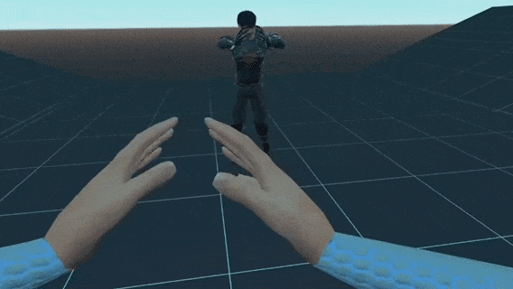

# Godot XR Avatar
 

## Overview

This is a project to aid developers using the Godot XR and XR-Tools assets in implementing a full-body VR inverse kinematics player character avatar.

It requires use of the Godot XR asset, found here: https://github.com/GodotVR/godot_openxr and XR-Tools asset, found here:https://github.com/GodotVR/godot-xr-tools (both are also in Godot's AssetLib).

This repository contains: 

(1) an godot-xr-avatar addon in the addons folder, intended for use in other projects; and

(2) demo scenes demonstrating different variations of how the VRIK Avatar works.

The aim of this code is to be as modular/drag and drop as humanly possible while balancing the need for devs to likely adjust certain parameters.

Therefore, some work is still required to enable this avatar code, especially if you want to do so with your own avatar model. 

READ THE INSTRUCTIONS BELOW.

 

## Functionalities Provided With Godot-XR-Avatar

This project enables you to have a full body VRIK avatar.  The hands of the avatar will follow the player hands, and the body will follow the player's body movement, whether the player is walking in real life, using direct movement, teleport, snap turn or smooth turn.

Pre-done animations and animation trees for hand poses (grip, point) and basic movement (walk forward, backward, strafe left, strafe right, idle/T-pose, sit) are provided for three types of skeletons: MakeHuman, Mixamo (when used with Blender's Mixamo addon) and ReadyPlayerMe.

The avatar code tracks the ground position and automatically places player feet on the ground (subject to adjustment of export variables relating to this), allows the player to jump with feet of the ground, and allows the player to crouch.

There is optional functionality to "bring your own" animations and animation tree.  If you use the same names of animations and tree structure as the samples, the code should "just work."  If you use a different animation naming / animation tree structure you will have to adjust the code accoringly to play YOUR animations the way you want.

There is optional functionality to use "procedural walk" instead of using pre-done animations.  However, no hand poses will be available with this method unless you use the animations provided or provide your own.  

Procedural hand animations are still under investigation - if you think you can help us create them, please do, and submit a pull request or let us know!!  That's the last thing we require to completely avoid the animations / animation tree if a dev doesn't want prebaked animations at all.

## Versions

This is in an beta state, it is working but there are issues to be expected.

## Available Demo Scenes

These demo scenes are available in the project:

(1) MakeHuman male player avatar with three "shadow" / doppelganger / mirror characters: demonstrates how to use a character created by MakeHuman (http://www.makehumancommunity.org/) and create a mirror character for the player

(2) MakeHuman female player avatar with mirror: demonstrates how to make and use a female MakeHuman character and an actual "mirror" to view player movements

(3) MakeHuman male player avatar with cyborg "shadow" character, ninja stars, and destructable table: demonstrates some additional options for use of weapons with VRIK avatar

(4) Mixamo player avatar with three mirrors and "shadow" character faced another direction: demonstrates how shadow character does not have to be facing player (similar mechanics could be used to create a "mech" functionality); and also demonstrates use of character with a mixamo skeleton

(5) Readyplayerme player avatar with mirror, LipSync enabled, and walk in place locomotion enabled: demonstrates how to use readyplayerme.glb as a player avatar, how the avatar can respond to other movement mechanics like walk in place without requiring joystick input, and how you can use the functionality provided by the Godot-Lipsync asset with the avatar to have it talk when you talk.

(6) Title / menu screen: sample title screen in Godot

## How to Use

The following sections will be broken into various potential use cases for this repository with instructions for each use case.  Below, though, you will also see video tutorials that you should watch.

	Playing the demo scene just to see what the avatar does
-----

The demo is all set to use as is, just unzip the directory, run the project.godot in Godot 3.5 and hit play, and everything should work.

Controls in the demo scene are as follows:

Left thumbstick - Move

Right thumbstick - Turn

Right thumbstick click - toggle crouch

Right A button - Jump

Grip buttons - grab weapons

Left Y button - Bring up scene switching radial menu; hover over a scene picture with your left hand and release Y button to jump to that scene

	Using the provided completed (prefab) VRIK Player Character Avatars in your own game
--------
Install the OpenXR and XR Tools plugins as directed on their respective sites and be sure to activate them in project settings.

Copy the godot-xr-avatar and godot-lipsync folders from "addons" in this repository into the "addons" folder in your repository.

If you want to use one of the provided variations of the MakeHuman avatar just click on "instance child scene" in the main spatial node of your scene and instance either "avatar_player.tscn" or "avatar_female_player" into your scene.  

If you want to use the provided mixamo or readyplayerme sample avatar, note the licenses first.  Then drag the demo folder from this repo corresponding to the avatar you want to use (mixamo_demo or readyplayerme_demo) into your project, and "instance child scene" either the avatar_player_mixamo.tscn or avatar_player_readyplayerme.tscn into your project.

You can then right click on the scene you chose once it is in your scene tree, and click "Make Local" so you can change anything about the avatars.  For instance, you can choose different XR Tools functions for the two hand controls. 

Double check that the paths for the ARVROrigin, ARVRCamera, LeftHandController, RightHandController and PhysicsHands nodes are set and match your project.

See the section below on "Explanation of Export Variables/Options" for other tweaks you can consider depending on your game.

When you run your scene, the avatar will create the nodes it needs for the VRIK at runtime and it should just work as your player body.

	Using the provided character models / animations with your own character controller rig in your own game
----
For whatever reason - for instance, maybe you already have a player character controller based on the OpenXR Asset / OpenXR Tools you really like in your project -- you may want to just "add" an avatar model we have provided to your current XR Rig setup.  

That is also pretty easy.

Make sure the OpenXR and XR Tools plugins as directed on their respective sites are installed and be they are activated in project settings.

Make sure you have a XRTools "PlayerBody" node in our XRRig as some of the avatar functions depends on references to how the XRTools PlayerBody node works.

Copy the godot-xr-avatar and godot-lipsync folders from "addons" in this repository into the "addons" folder in your repository.

Choose the model you want to use.  If one of the MakeHuman ones, you do not need to drag over any other folders.  If you want to use the Mixamo one, drag the mixamo_demo folder into your project, or if readyplayerme, drag the readyplayerme_demo into your project.

Click on your FPController/ARVROrigin node, and instance child scene,and choose the model file you want (i.e., avatar.gltf, avatar_female.gltf, avatar_makehuman_lipsync.gltf, mixamo_avatar.gltf, readyplayerme.glb).  

Once your model is in the scene, click on "make local."  

Delete the AnimationPlayer node child of the model.

Click on the top spatial node of the avatar model and attach script.  Select the "automated_avatar.gd" script found in addons/godot-xr-avatar/scripts.

In the inspector, when you click on that node that has the script attached, you should see export NodePath variables where you should select the paths to your ARVROrigin, ARVRCamera, LeftHandController, RightHandController, LeftHand and RightHand nodes.

See the section below on "Explanation of Export Variables/Options" for other tweaks you can consider depending on your game.

When you run your scene, the avatar will create the nodes it needs for the VRIK at runtime and it should just work as your player body.

	Using your own 3D avatar file with this repo's scripts in your own game
------

This repo's scripts are intended to support 3D character files made with MakeHuman, Mixamo (via Blender's Mixamo addon) or ReadyPlayerMe.

You should watch the video tutorials on creating and importing your own avatar.  Here is a brief written explanation.

Provided that you have made your avatar as directed in the videos (or for ReadyPlayerMe, no special steps are needed, just download your RPM avatar .glb file from the RPM website after you have generated it), the process is basically the same as "Using the provided character models/animations with your own character controller rig in your own game" above.

Make sure the OpenXR and XR Tools plugins as directed on their respective sites are installed and be they are activated in project settings.

Make sure you have a XRTools "PlayerBody" node in our XRRig as some of the avatar functions depends on references to how the XRTools PlayerBody node works.

Instance your avatar model as a child of the FPController/ARVROrigin in your scene.

Make the avatar model local so you can modify it.

Click on the top spatial node of the avatar model and attach script.  Select the "automated_avatar.gd" script found in addons/godot-xr-avatar/scripts.

Your avatar model should have the following structure:

	Top Spatial Node

	Spatial Node Called "Armature" as its child

	Skeleton as a child of Armature

If you do not have that structure, it is likely the script will not work as intended.  If you node is not called "Armature" you can just rename it.

When you click on the avatar node that has the automated avatar script attached, you should see export NodePath variables where you should select the paths to your ARVROrigin, ARVRCamera, LeftHandController, RightHandController, LeftHand and RightHand nodes.

If you want to use your own custom animations, make sure the export variable for automatic animation is set to NO and the export variable for procedural walk is set to NO.  Ideally use the same animationtree format and naming as already found in the demo examples.  

If you want to use different naming and animationtree format, that is fine but you will need to look at and modify the automated_avatar.gd code to point to the proper naming of your blend trees for hand poses and avatar animations.  

See lines 591-596 (hand pose animation code) and 624-627 (body animation code) of the automated_avatar.gd to modify.

The way our animation code works is:

-It gets the amount of the grip value and trigger value and sets the values of Blend2D nodes corresponding to a grip animation with filters for the fingers
-It queries the PlayerBody node's velocity and generates a Vector2 that has the lateral (left/right) movement as the x coordinate of the Vector2 and the forward / back movement as the y coordinate of the Vector2.  
-It then takes that Vector2 and uses the values to select a blend of the forward/back/left/right animations in a BlendSpace2D node.

You can do animations however you want; if you turn off automatic animations and comment out the lines indicated above, you can write code for however you want your hand and body animations to work instead.

If you want to use our provided animations and animation structure instead with your own model, then select the type of model you have in the AutomaticAnimations drop down variable (MakeHuman, Mixamo, ReadyPlayerMe).  

The code will then pull in an AnimationPlayer and AnimationTree at runtime with pre-done animations for the chosen model type that fits with our structure and it should "just work" with your model.

	Explanation of Export Variables/Options
-----

In the spirit of trying to provide a lot of automatic support out of the box but not wanting to hamstring developers, we tried to provide a lot of export variables that can be used to tweak the avatar the way you want it.  Experimentation will be required to get the result you want, with your model.

ARVRORIGIN/CAMERA/CONTROLLER/HAND PATHS (Default: Blank):

You must set these to correspond to your XR Rig.  Your XR Rig must also have a XRTools PlayerBody node.

AUTOMATICANIMATION

	Options: NO, MAKEHUMAN, MIXAMO, READYPLAYERME (Default: No)

		No: Do not use any of our automatic provided animations. You will provide your own or not use any.

		Makehuman: Automatically selects and implements a premade AnimationPlayer, animations and AnimationTree at runtime for a MakeHuman character skeleton/model found in addons/godot-xr-avatar/animations/make_human_animations

		Mixamo: Automatically selects and implements a premade AnimationPlayer, animations and AnimationTree at runtime for a Mixamo character skeleton/model (made with the Blender MakeHuman plugin) found in addons/godot-xr-avatar/animations/mixamo_animations

		ReadyPlayerMe: Automatically selects and implements a premade AnimationPlayer, animations and AnimationTree at runtime for a ReadyPlayerMe character skeleton/model found in addons/godot-xr-avatar/animations/ready_player_animations

use_Procedural_Walk (Default: No)

	step_anim_height

	step_anim_time

	step_distance 

	strafe_step_modifier
	
This export variable turns on procedural walking animations instead of using the pre-made ones - or will be blended with them if you do not select "NO" for AUTOMATEDANIMATION.  Height is how high the steps are, distance is how far the legs reach for a step, time is the time to complete an animation cycle.

Strafe step modifier can be used to decrease how far the steps are when the player is strafing left or right if set to a float less than 1.0 but greater than 0.0.

use_procedural_bounce (Default: No)

This export variale creates an up and down movement of the character while walking to try to simulate a more natural walking animation. It can be used with or separate from use_procedural_walk.  The max_legs_spread and bounce_factor variables influence how dramatic the bounce is.  You can experiement with the values to see what you like.

use_automated_lipsync (Default: False) and face_mesh_with_visemes_path

Choose whether to use the Godot-Lipsync addon to move your character's mouth to your mic audio.  For this to work you need a face mesh that has viseme blend shapes.  See the ReadyPlayerMe demo scene and Godot_Dojo_LipSync_Demo scene for examples.  

Set the path to your mesh with visemes in the face_mesh_with_visemes_path export variable and mark use_automated_lipsync to true if you want to use this.  Then at runtime the script will generate the required nodes for the lipsync.  

Make sure to turn on microphone access in the project and in your export settings.

height_offset : Used to tweak how high the player sits versus the avatar model's position on the y axis.

foot_offset : Use to tweak where the bottoms of the avatar's feet fall (tweak so they are on the ground while walking or standing in your scene)

ik_raycast_height : Use to tweak how far the raycasts used to detect the ground span. Default should normally be fine.

var min_max_interpolation : Influences how much the animations interpolate with the SkeletonIK of the avatar.

smoothing : Influences how much the animations interpolate with the SkeletonIK of the avatar.

avatar_z_offset := Pushes player avatar body back or forward from the player's camera position.  May need tweaking depending on model so you can see down your player body but not inside of it.

turn_character_180 : Rotate the Skeleton node 180 degrees on the Y axis (rotation_degrees.y = 180) if needed to ensure that the face of your avatar points away from the Z (negative) axis.

head_visible / hand_mesh_visible :

If you want to hide the head node, be sure to select the nodes that pertain to the head/face in your avatar in the export array indicated for that purpose in the Inspector ("Head Mesh Node Paths") and then choose the box to hide the head mesh.

You can choose whether to hide the heads or hand meshes as export variables.

## Video Tutorials - hosted on YouTube
### Tutorial 01 - Setup MPFBv2 Addon and Brief Intro

### Tutorial 02 - Makehuman to Blender/ Splitting mesh into parts

### Tutorial 03 - import and Avatar Setup inside Godot

### Tutorial 04 - Setup ReadyPlayerMe

### Tutorial 05 - Setup Makehuman/LipSync

more Tutorials forthcoming.

Credits
---------
This repo's code is based heavily from / derived from the work of SYBIOTE (https://github.com/SYBIOTE) based on an unpublished project for VR avatars that he graciously shared.

SYBIOTE's original code was made to be used with functions and code from the Godot Oculus Quest Toolkit, developed by NeoSpark314 (https://github.com/NeoSpark314/godot_oculus_quest_toolkit), and so some of the functions of the toolkit were translated and used in this project.

This repo translates various code from reliance on the Oculus Quest Toolkit and OVR plugins to the newer OpenXR asset and XR Tools and then adds code to account for finger positioning.

You can find the latest version of the Godot OpenXR asset at: https://github.com/GodotVR/godot_openxr and XR Tools at https://github.com/GodotVR/godot-xr-tools. 

In further modifying the SYBIOTE code, inspiration was taken from GoatChurchPrime's work in https://github.com/goatchurchprime/OQ_Avatar_Mapping/

Additional thanks and credits go out to teddybear082 (https://github.com/teddybear082) who made it work with Godot's XR Plugin and much more and last but not least a special thank you to (https://github.com/Malcolmnixon), who fixed the remaining issues, without this additional help, this project would not be here.

Licensing - Code: MIT License
---------
The CODE in this repository is licensed under the MIT license.

demo - License: CC0 1.0 Universal
---------
The contents of the demo folder (excluding the code) are under the CC0 1.0 Universal Public Domain License.

readyplayerme_demo - License: Attribution-NonCommercial-ShareAlike 4.0 International
---------
folder contains a model made with https://readyplayer.me/
it is Licensed under Attribution-NonCommercial-ShareAlike 4.0 International. Therefore you are not allowed to use it commercialy. The only reason why we have included it in the first place is to give potential developers a head start if they choose to include readyplayerme avatars in their app using the xr avatar addon. 

About this repository
---------------------
#### This repository was created by and is maintained by
##### (alphabetical order)
##### Malcolm Nixon
##### Miodrag Šejić aka DigitalN8m4r3
##### Rahul Ghosh aka SYBIOTE
##### teddybear082
